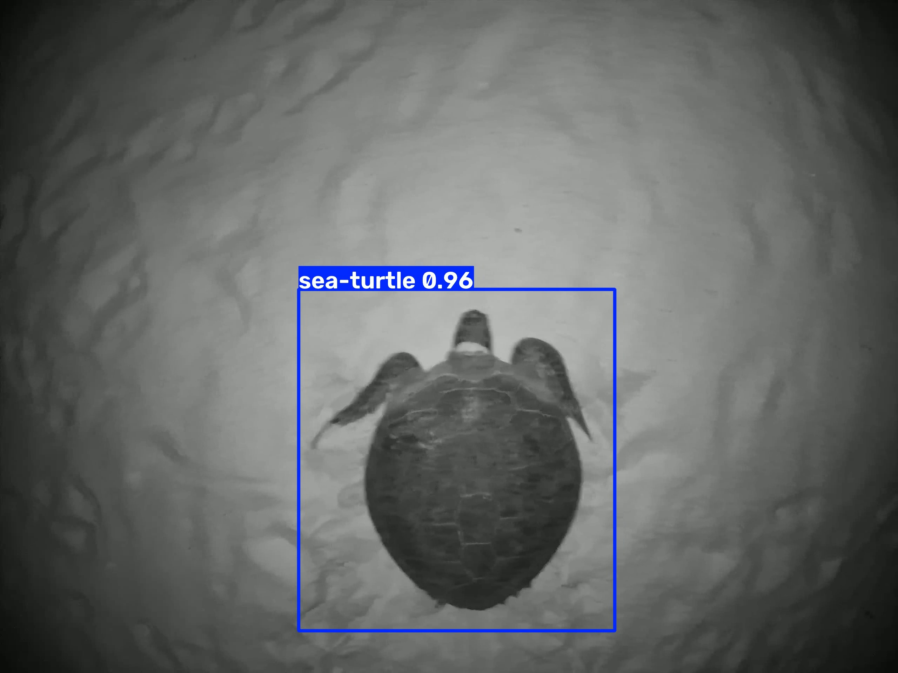

# 🐢 Sea Turtle Detection in Video

This project explores how YOLO can be used to detect sea turtles in video frames and build a simple protected-species video detection prototype.

## 📊 Dataset

**Dataset:** [GTST-2023](https://doi.org/10.34740/kaggle/ds/5348665)

GTST-2023 contains sea turtle videos, extracted frames, and object-detection annotations. The full dataset includes 42 videos and 14,471 annotated frames. citeturn963189search0turn963189search2

This project uses 12 video sequences and 6,580 annotated frames.

The dataset was split by complete video sequence to reduce data leakage between similar consecutive frames:

- Train: 4,309 images
- Validation: 1,407 images
- Test: 864 images

## 🎯 Project Goals

1. Train a YOLO model to detect sea turtles.
2. Evaluate the model on unseen video sequences.
3. Apply the trained model to video inference.

## 🧠 Methods

- JSON annotation to YOLO format conversion
- Video-level train / validation / test split
- YOLO11n with pretrained weights
- 20 training epochs
- GPU training with CUDA

## 📈 Main Results

### Validation

- Precision: **0.990**
- Recall: **0.966**
- mAP@0.5: **0.984**
- mAP@0.5:0.95: **0.922**

### Test

- Precision: **0.989**
- Recall: **0.973**
- mAP@0.5: **0.984**
- mAP@0.5:0.95: **0.896**

The model also successfully generated sea turtle bounding boxes and confidence scores on an original video.

## 🔍 Key Findings

YOLO11n achieved strong detection performance on the GTST-2023 subset.

Using video-level splitting helped reduce leakage from highly similar consecutive frames.

## ⚠️ Limitations

- Only 12 video sequences were used.
- The model detects only one class: sea turtle.
- The dataset contains nesting sea turtles rather than fisheries onboard footage.
- Performance in other marine environments has not been tested.

## 🚀 Future Work

- use more GTST-2023 videos
- compare larger YOLO models
- add multi-class protected-species detection
- add object tracking
- test on fisheries onboard footage

## 🛠 Technologies

Python, PyTorch, Ultralytics YOLO, OpenCV, Matplotlib, CUDA
